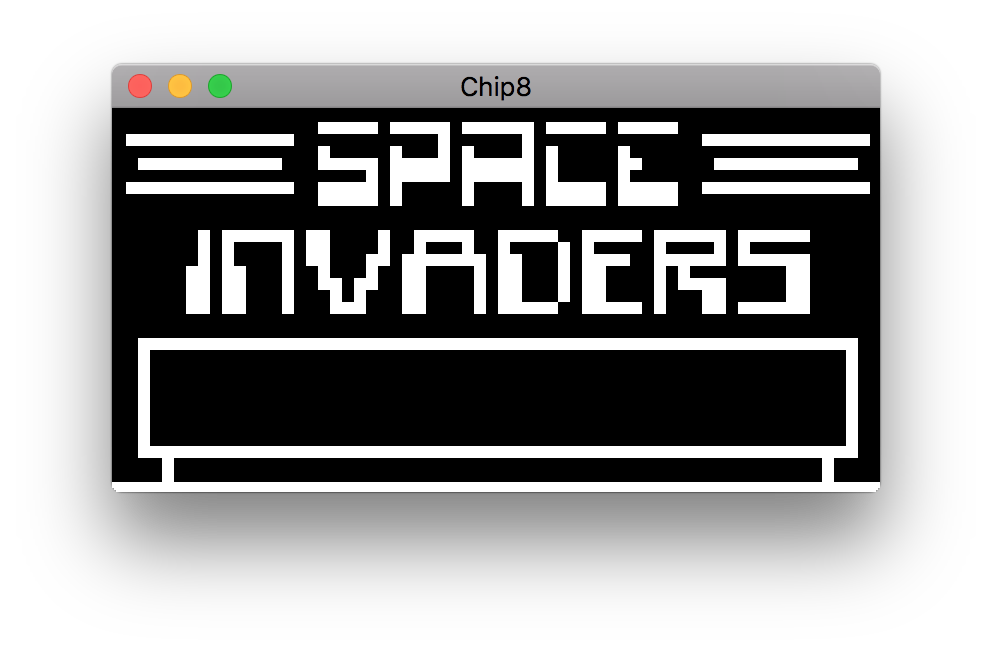
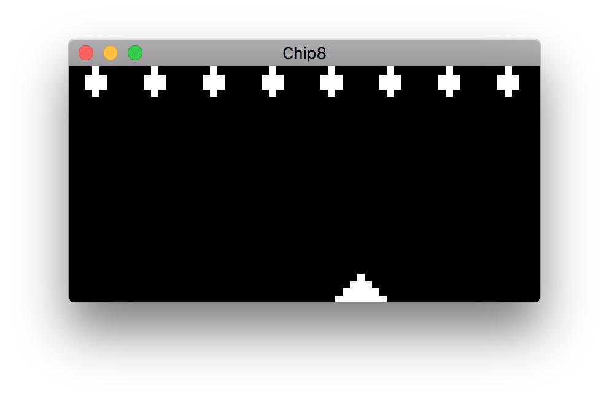
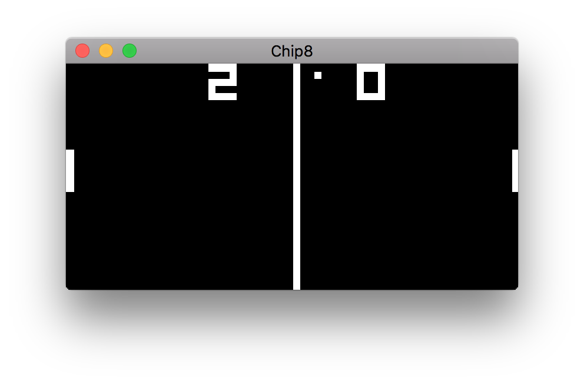
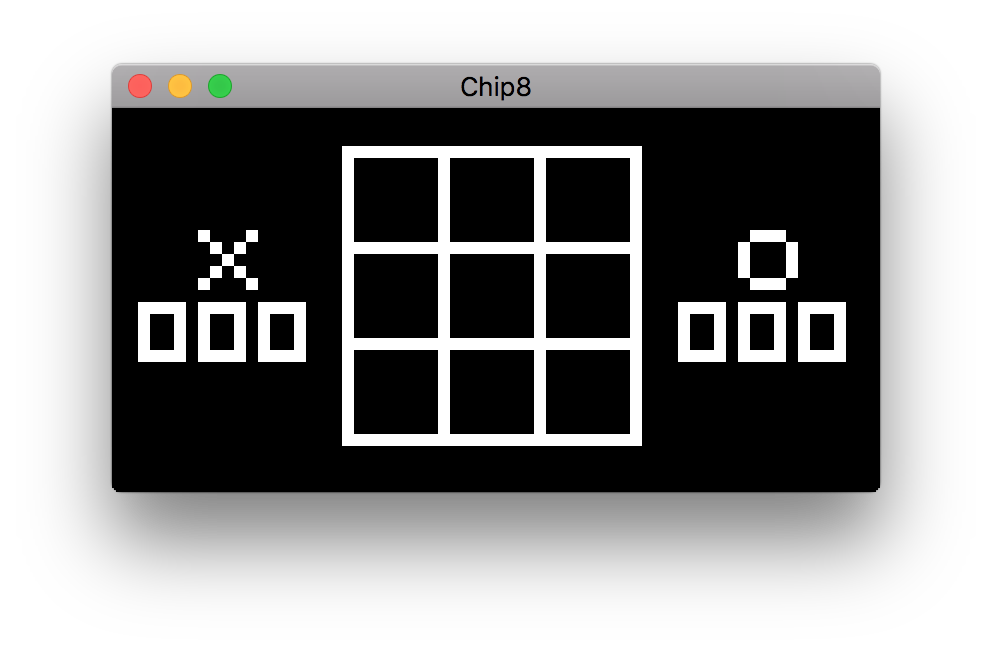
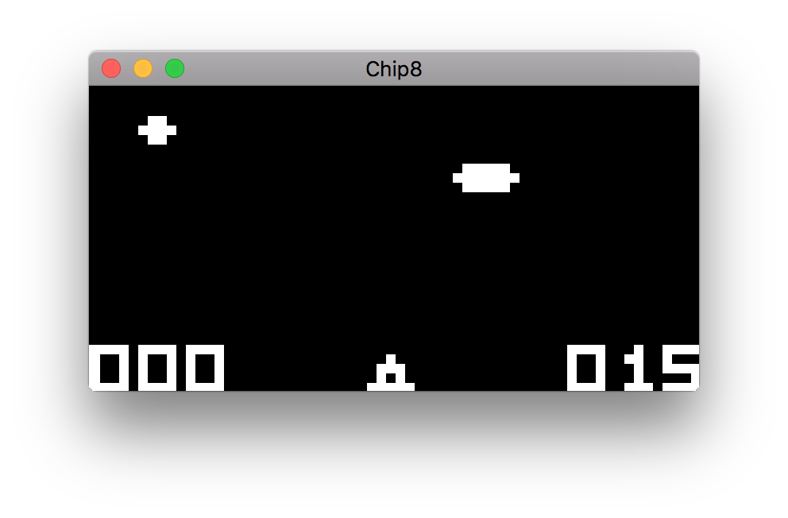

# GChip8
A straightforward chip8 emulator.

## Building
Building requires SDL2 to be installed on the system.

```
$ make
$ ./bin/GChip8 [game file path]
```

## Screenshots







## License
See the [license](./LICENSE) file for license rights and limitations (MIT).
